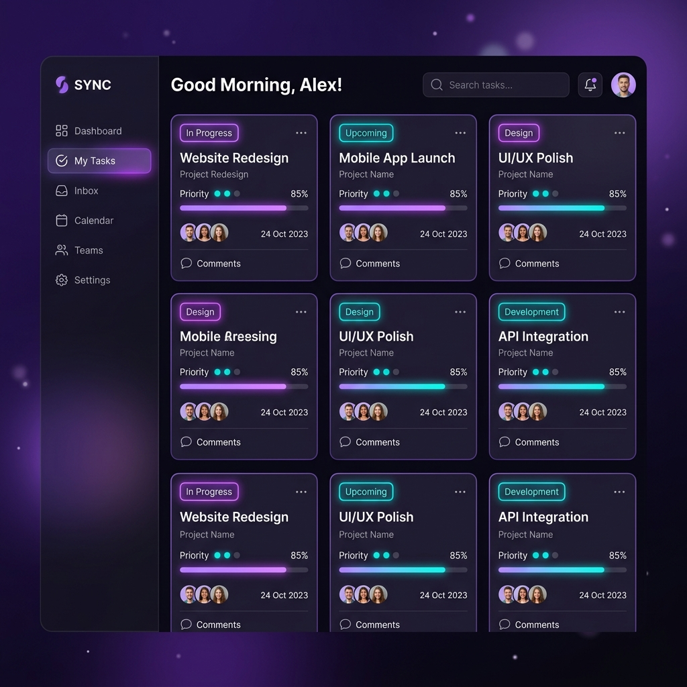

# 🚀 Rails Task Manager


A beautifully designed, full-stack Task Management application built with Ruby on Rails 7. This project demonstrates proficiency in modern Rails development, MVC architecture, custom CSS design systems, and seamless SPA-like interactions using Hotwire (Turbo & Stimulus).

---

## ✨ Features

- **Premium UI/UX:** A stunning dark-mode interface featuring glassmorphism, glowing neon accents, and smooth hover micro-animations.
- **Hotwire Integration:** Fast, seamless page transitions without full page reloads, providing a Single Page Application (SPA) feel.
- **Task Management:** Full CRUD (Create, Read, Update, Delete) functionality for tasks.
- **Status Tracking:** Easily organize tasks by `Pending`, `In Progress`, or `Completed`.
- **Responsive Design:** Optimized for both desktop and mobile viewing.

---

## 🎨 UI Preview



---

## 🛠 Tech Stack

- **Backend:** Ruby on Rails 7.1.5
- **Frontend:** HTML5, Custom CSS3 (Glassmorphism design), Hotwire (Turbo & Stimulus)
- **Database:** SQLite3
- **Typography:** Google Fonts (Inter)

---

## 🚀 Getting Started

To get a local copy up and running, follow these simple steps.

### Prerequisites

- Ruby (v3.3.5 or higher recommended)
- Rails (v7.1.5 or higher)
- SQLite3

### Installation

1. **Clone the repository**
   ```sh
   git clone https://github.com/shaikmuskan27/rails_task_manager.git
   cd rails_task_manager
   ```

2. **Install dependencies**
   ```sh
   bundle install
   ```

3. **Setup the database**
   ```sh
   bin/rails db:create db:migrate
   ```

4. **Start the server**
   ```sh
   bin/rails server
   ```

5. Open your browser and navigate to `http://localhost:3000`

---

## 👨‍💻 Author

**Shaik Muskan**
- GitHub: [@shaikmuskan27](https://github.com/shaikmuskan27)

If you find this project interesting, feel free to reach out or drop a ⭐ on the repository!
